A pendência não nasce toda de uma vez, e isso surpreende quem chega agora. Duas
pessoas da mesma reunião podem estar vendo coisas diferentes no painel no mesmo
dia, e as duas estão certas.

## A regra curta

**A pendência nasce quando o compromisso da pessoa se firma**, e não quando a
ata inteira fica pronta. Firmar é uma destas três coisas: assinar a ata,
aceitar pelo link, ou o Facilitador finalizar a ata sem assinatura.

Nascida, ela é plena desde o primeiro segundo: aparece na lista e no quadro,
com o prazo correndo e podendo virar **Atrasado**.

## Os quatro momentos

1. **Alguém assina no ClickSign.** Nascem as ações daquela pessoa, e só elas.
2. **O Facilitador assina.** Além das dele, nascem as ações de responsáveis que
   não estão na lista de quem assina. A assinatura de quem conduziu a reunião
   autoriza as demais.
3. **Alguém aceita pelo link.** Nascem de uma vez todas as ações daquela
   pessoa, e o aceite conta como o "assinou" dela.
4. **O documento fecha.** Nasce todo o resto e a reunião fica **Assinada**.

No caminho sem assinatura é mais simples: **Finalizar sem assinatura** cria
todas as pendências no mesmo instante e a reunião fica **Aprovada**.

## O prazo da assinatura digital não mata a ata

Se o prazo da coleta de assinaturas estoura, o documento fecha com as
assinaturas que tiver. A ata não fica presa: as pendências que faltavam nascem,
a reunião vira **Assinada** e o banner ganha um selo discreto do tipo
**3 de 5 assinaram**. Com todo mundo assinado, esse selo não aparece.

## Quando ninguém assinou

Se a assinatura digital é recusada ou cancelada, ela não é reenviada. A
reunião passa a **Coleta interna de aceites**: quem falta recebe um link para
ler a ata e aceitar por dentro da plataforma. Quando toda ação do quadro tem
pendência, a reunião fecha.

O que já nasceu fica. Ação que já virou pendência não volta a ser editável.

## Por que a sua ação não apareceu

- **Você não assinou ainda.** As suas nascem quando você firma.
- **Você não é quem assina, e o Facilitador ainda não assinou.** Espere ele.
- **A ata ainda está em validação.** Nada nasce antes de o Facilitador fechar.
