Esta seção cobre o ciclo inteiro de uma reunião do hospital: marcar no
calendário, registrar o que foi tratado, fechar a ata e acompanhar o que cada
pessoa se comprometeu a fazer. O que interessa à plataforma é o compromisso
que sai do documento.

## As palavras que você vai ver o tempo todo

**Reunião** é o encontro marcado, com data, hora, tipo e participantes. Ela
nasce **Programada** e caminha até um fim: **Assinada**, **Aprovada** ou
cancelada.

**Facilitador** é quem conduz a reunião e responde pela ata: marca, revisa,
aprova e envia para assinatura. É ele que entra na plataforma.

**Participante** é quem foi chamado para a reunião. Nem todo participante entra
na plataforma: quem não tem conta recebe o convite da reunião por email e, se
tiver que assinar a ata, o email da assinatura.

**Transcrição** é o texto do que foi falado na reunião. É o que você anexa para
a ata sair pronta.

**Ata** é o documento da reunião: pauta, discussão, decisões e o quadro de
ações. Ela pode nascer de dois jeitos, e cada reunião tem uma só.

**Ata Guiada** é a ata de uma reunião que não teve transcrição, montada numa
conversa com o assistente da plataforma.

**Pendência** é cada ação do quadro da ata virada compromisso de alguém, com
responsável e prazo. É ela que aparece na lista, no quadro e nas cobranças.

**Repactuada** é o estado de quem perdeu o prazo combinado e vai receber outro.
Marcar uma pendência como Repactuada apaga a data dela, e a data nova você
escreve na mesma pendência. É a mesma linha o tempo todo, com o histórico de
comentários intacto.

## Dois caminhos para a mesma ata

Você escolhe o caminho na hora de fechar a ata, não no cadastro.

- **Com transcrição:** você anexa o texto da reunião, o assistente monta a ata
  completa, gera o documento e ela pode ir para assinatura digital.
- **Guiada:** você conversa com o assistente e ele monta um resumo e o quadro
  de ações ao vivo. Esse caminho termina sem assinatura.

E, no fim, dois desfechos possíveis:

- **Enviar para assinatura** leva a ata para a assinatura digital, e ela
  termina **Assinada**.
- **Finalizar sem assinatura** cria as pendências na hora e a ata termina
  **Aprovada**. É definitivo: não existe assinar depois.

## O caminho de uma ata, de ponta a ponta

1. **Alguém marca a reunião.** O Facilitador marca pelo
   [Calendário](/reunioes/marcar-uma-reuniao-no-calendario/); a Secretária
   marca pela tela dela, em
   [Marcar a reunião de um facilitador](/reunioes/marcar-a-reuniao-de-um-facilitador/).
2. **A reunião acontece** e o Facilitador
   [anexa a transcrição](/reunioes/anexar-a-transcricao-da-reuniao/), ou
   [monta a ata conversando](/reunioes/montar-a-ata-conversando/) quando não
   houve transcrição.
3. **O assistente escreve a ata** e devolve para você. Quando ele encontra
   nomes que não batem com o cadastro, pede para você resolver antes de seguir.
4. **O Facilitador revisa e fecha**, em
   [Revisar e aprovar a ata](/reunioes/revisar-e-aprovar-a-ata/).
5. **Quem precisa assinar assina**, em
   [Enviar a ata para assinatura](/reunioes/enviar-a-ata-para-assinatura/), e
   quem não assinou pode
   [aceitar pelo link](/reunioes/aceitar-a-ata-pelo-link/), sem entrar na
   plataforma.
6. **As pendências nascem** e passam a ser acompanhadas na
   [Lista](/reunioes/acompanhar-as-pendencias-na-lista/), no
   [Kanban](/reunioes/mover-as-pendencias-no-kanban/) e no
   [Dashboard](/reunioes/acompanhar-o-dashboard/).

A pendência **não espera** a ata inteira ficar pronta: quem assina primeiro já
solta as pendências dele. Isso está em
[Quando a pendência nasce](/reunioes/como-funciona/quando-a-pendencia-nasce/).

## E as metas?

**Metas** é parte do nome do grupo no menu, não uma tela à parte. Quem
acompanha meta acompanha pelo quadro de pendências e pelo Dashboard: prazo,
conclusão e o percentual **No Prazo**.
