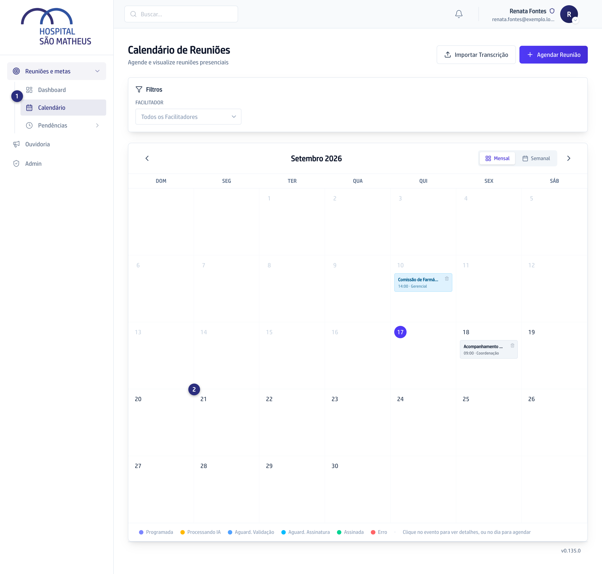
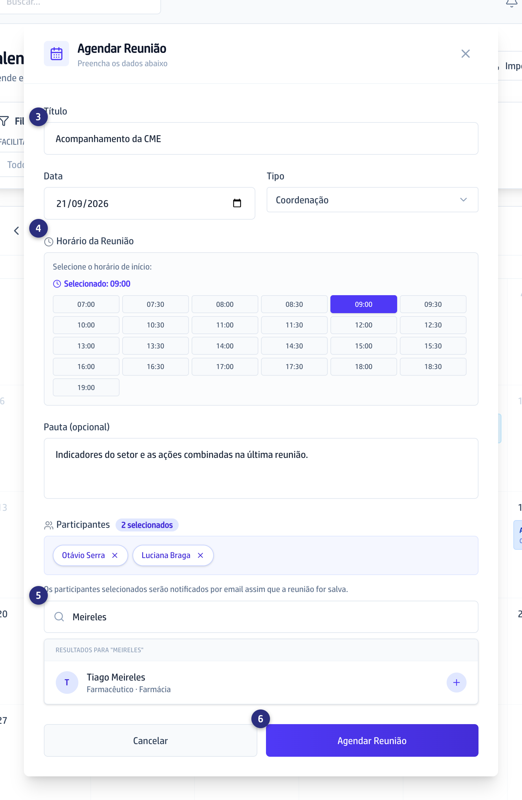

## Quando usar

Quando a reunião já tem data e você quer reservá-la e avisar quem vai. Ela
nasce com quem marcou no comando.

:::caution[Quem marca vira o facilitador]
A reunião nasce com quem clicou aqui no comando da ata.
:::

## Passo a passo

1. No menu, clique em **Calendário**. Quem conduz reuniões acha ele dentro do
   grupo **Reuniões e metas**; na Secretaria ele fica solto.

   
2. Clique no dia da reunião. A janela **Agendar Reunião** abre com a data
   preenchida.
3. Escreva o **Título** e confira a **Data**. Em **Tipo**, escolha
   **Diretoria**, **Gerencial**, **Coordenação**, **Mensal** ou
   **Extraordinária**.

   
4. Em **Horário da Reunião**, escolha a hora de início, e escreva a
   **Pauta (opcional)**.
5. Em **Participantes**, procure cada pessoa em **Buscar participante...** e
   clique no nome para incluir.
6. Clique em **Agendar Reunião**. Os participantes recebem o convite por email
   na hora.

Reunião que se repete: abra ela e use **Recorrência**, depois **Configurar**.
A **Frequência** é **Semanal** ou **Quinzenal**.

## Se der errado

- **Você é da Secretaria:** marcando por aqui, a reunião fica com **você** como
  facilitadora, e depois você não monta a ata dela. Para marcar a de outra
  pessoa, use
  [Marcar a reunião de um facilitador](/reunioes/marcar-a-reuniao-de-um-facilitador/).
- **A pessoa que você procura não aparece:** só quem está cadastrado aparece na
  busca, dez por vez. Escreva mais letras do nome, ou peça a quem administra a
  plataforma para cadastrar a pessoa.
- **Você marcou no dia errado:** abra a reunião e corrija a data enquanto ela
  estiver **Programada**. Para desistir, use a lixeira no cartão.
