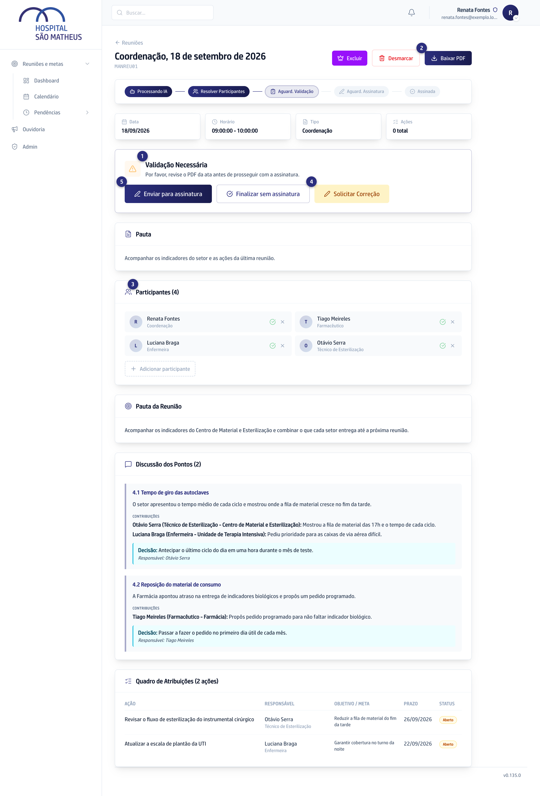
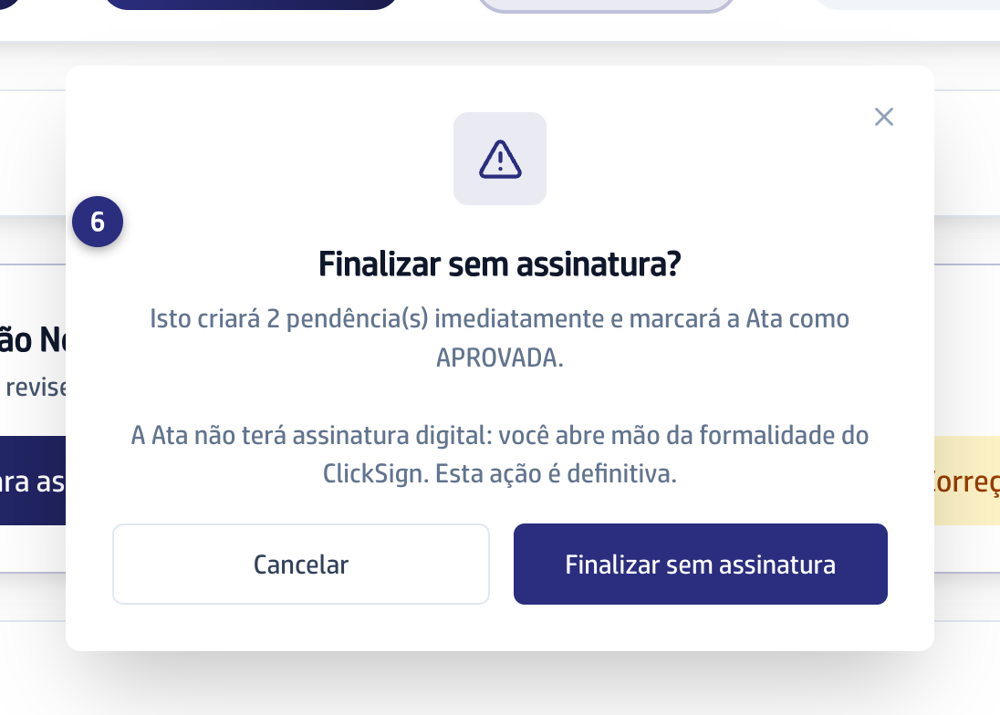

## Quando usar

Quando a ata já está escrita e a reunião mostra **Validação Necessária**. É o
momento em que você assume o texto: depois de fechar, ele não volta atrás.

## Passo a passo

1. Abra a reunião. O bloco **Validação Necessária** fica no alto, logo
   abaixo dos cartões **Data**, **Horário**, **Tipo** e **Ações**.

   
2. Leia a ata inteira. Clique em **Baixar PDF** para conferir o documento final.
3. Confira a lista de **Participantes**. O X tira a pessoa da ata e da lista de
   quem vai assinar; o campo de busca acrescenta quem faltou.
4. Para mudar o texto, clique em **Solicitar Correção** e diga o que muda. Ele
   reescreve a narrativa, a discussão, o quadro e o objetivo, nunca a lista de
   participantes.
:::caution[Finalizar sem assinatura não tem volta]
As pendências nascem na hora e assinar depois não existe.
:::

5. Escolha o desfecho: **Enviar para assinatura** ou
   **Finalizar sem assinatura**.
6. Finalizando sem assinatura, confirme na janela: ela mostra quantas
   pendências vão nascer.

   

## Se der errado

- **Você tirou alguém da ata por engano:** procure a pessoa na busca dos
  participantes e acrescente de novo. Ela volta para a ata e para a lista de
  quem assina, sem email nenhum: o de assinar só sai quando você enviar para
  assinatura.
- **A tela não deixa remover um participante:** quem responde por uma ação do
  quadro não sai da ata. Troque o responsável primeiro.
- **Você pediu a correção e o texto voltou igual:** peça de novo, citando a
  seção. **Apontar para esta seção** mira um trecho só.
- **Você finalizou sem assinatura e queria assinatura:** não tem volta.
