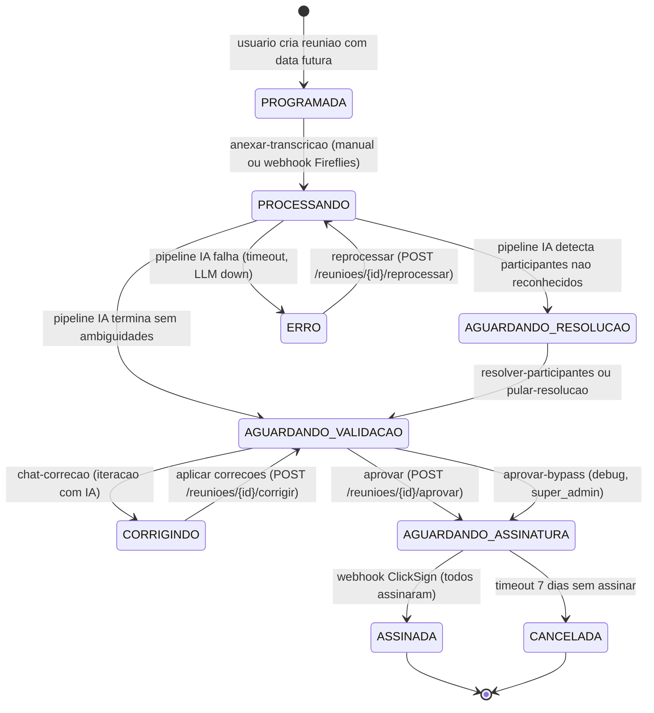
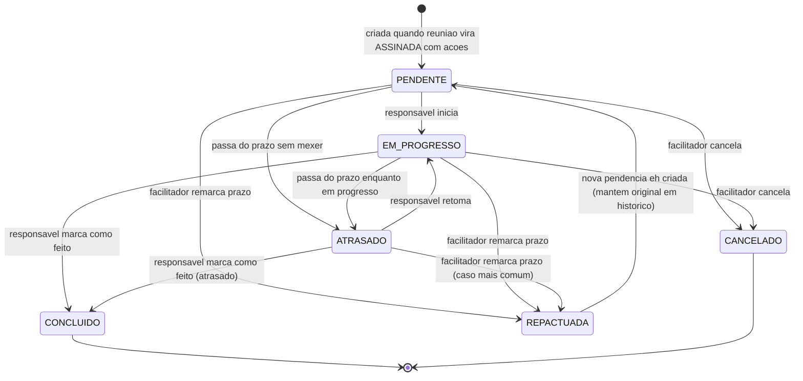
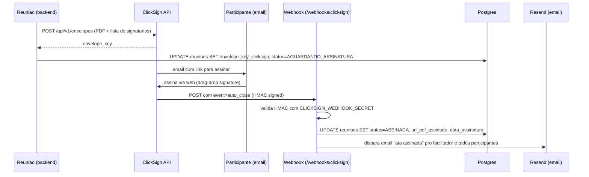
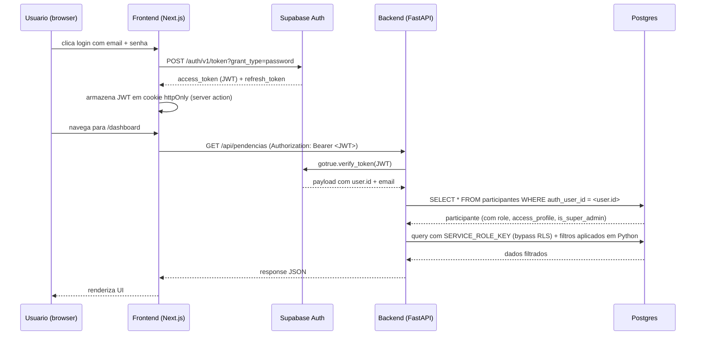
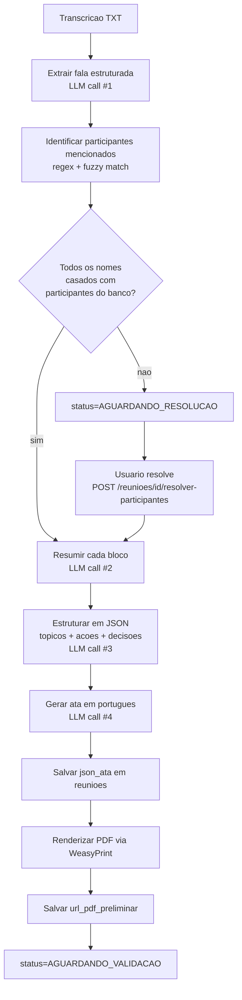

# FLUXOGRAMAS.md
<!-- mantido manualmente — /snapshot só alerta se rota/estado novo apareceu sem fluxo correspondente -->
<!-- last_human_update: 2026-05-21 -->

Diagramas de máquina de estado e fluxos críticos da aplicação Hospital Reuniões. Mermaid renderiza nativo no GitHub e no GitHub Mobile.

## Ciclo de vida de uma Reunião

<!-- curated:start -->

**Estados explicados (para leigo):**
- **PROGRAMADA** — reunião marcada na agenda, ainda não aconteceu (ou aconteceu e ainda não foi processada).
- **PROCESSANDO** — IA está gerando ata a partir da transcrição (~30s a 2min).
- **AGUARDANDO_RESOLUCAO** — IA achou nomes na transcrição que não casam com nenhum participante cadastrado. Pede resolução manual.
- **AGUARDANDO_VALIDACAO** — ata pronta, esperando facilitador conferir e aprovar.
- **CORRIGINDO** — facilitador pediu uma correção via chat. IA reescrevendo.
- **AGUARDANDO_ASSINATURA** — ata aprovada, enviada pra ClickSign, esperando todos assinarem.
- **ASSINADA** — ciclo fechado. PDF assinado disponível.
- **CANCELADA** — abandonada por timeout ou ação manual.
- **ERRO** — falha técnica recuperável via reprocessamento.
<!-- curated:end -->

---

## Ciclo de vida de uma Pendência

<!-- curated:start -->

**Cron jobs envolvidos:**
- `cron/alerta_prazo.py`: roda diariamente, marca como `ATRASADO` quem passou do prazo e notifica responsável + facilitador.
- `cron/notificacao_prazo_proximo.py`: notifica 24h antes do prazo (in-app via `notificacoes`).
<!-- curated:end -->

---

## Assinatura ClickSign (webhook)

<!-- curated:start -->

<!-- curated:end -->

---

## Autenticação (Supabase Auth + JWT)

<!-- curated:start -->

**Observação:** O Hospital Reuniões NÃO usa RLS direto do frontend. Backend FastAPI faz tudo via `SERVICE_ROLE_KEY` e aplica controle de acesso na camada de aplicação. Isso simplifica policies do Supabase mas exige disciplina em cada endpoint.
<!-- curated:end -->

---

## Pipeline de IA (transcrição → ata)

<!-- curated:start -->

**Configuração:** primary LLM = OpenRouter (`openai/gpt-5.4-mini`). Fallback automático para OpenAI se OpenRouter cair (`LLM_FALLBACK_MODEL`, default `gpt-4o-mini`).
<!-- curated:end -->

---

## Alertas automáticos do `/snapshot`

`/snapshot` faz pré-check de **gaps de fluxograma** ao regenerar os outros 6 arquivos. Se uma rota nova foi adicionada em `ROTAS.md` ou um estado novo apareceu em `ENTIDADES.md` (enum changed) sem fluxograma correspondente aqui, a skill imprime aviso pra você considerar adicionar.

Exemplos:
- Rota nova `POST /pendencias/{id}/repactuar` → aviso "considere adicionar transição REPACTUADA no fluxograma de Pendência".
- Estado novo no enum `status_ata` → aviso "estado X aparece em ENTIDADES.md mas não no fluxograma de Reunião".

A regeneração dos diagramas continua **manual** (curadoria humana). A skill só alerta.
