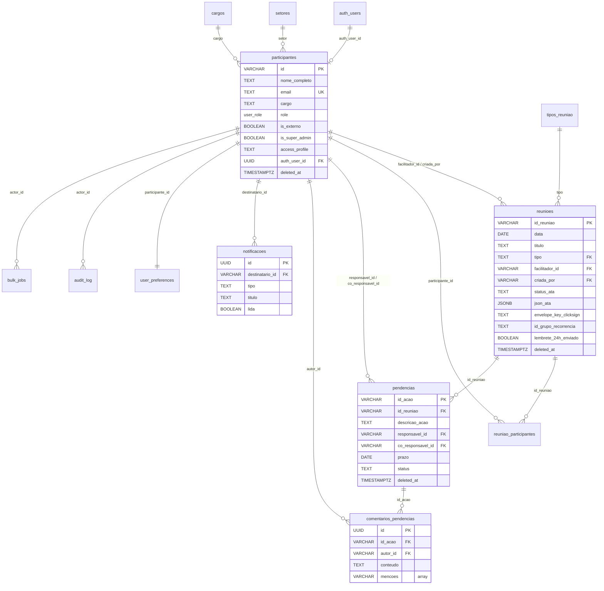

# SCHEMA.md
<!-- gerado automaticamente por /snapshot — não editar -->
<!-- last_update: 2026-05-21T15:58-03:00 -->

Diagrama relacional do banco Hospital Reuniões (Postgres via Supabase). Renderiza nativo no GitHub.

## Diagrama ER (visão de domínio)

## Indexes críticos (migration `038_fk_indexes.sql` + outros)

| Tabela                  | Index                                                    | Pra que                                 |
|-------------------------|----------------------------------------------------------|-----------------------------------------|
| reunioes                | `idx_reunioes_data`                                      | listagem cronológica                    |
| reunioes                | `idx_reunioes_facilitador_id`                            | filtro por facilitador                  |
| reunioes                | `idx_reunioes_deleted_at`                                | esconder soft-deleted                   |
| reunioes                | `idx_reunioes_grupo_recorrencia`                         | navegar série recorrente                |
| pendencias              | `idx_pendencias_id_reuniao`                              | drill-down por reunião                  |
| pendencias              | `idx_pendencias_responsavel_id`                          | "minhas pendências"                     |
| pendencias              | `idx_pendencias_status_deleted_at`                       | dashboards                              |
| comentarios_pendencias  | `idx_comentarios_id_acao`                                | thread de comentários                   |
| notificacoes            | `idx_notificacoes_destinatario_lida`                     | contagem de não-lidas                   |
| audit_log               | `idx_audit_log_timestamp_desc`                           | últimos N logs                          |
| audit_log               | `idx_audit_log_actor_id`                                 | filtro por ator                         |

## RLS (Row Level Security)

Habilitada em todas as tabelas operacionais via `009_enable_rls.sql` e `023_enable_rls_audit_bulk.sql`.

Estratégia: o backend FastAPI usa `SUPABASE_SERVICE_ROLE_KEY` (bypass RLS) e aplica controle de acesso na camada de aplicação via `Depends(get_current_user)`. Frontend usa `SUPABASE_ANON_KEY` apenas para login/auth, não consulta dados diretamente.

## Storage Buckets (`006_create_storage_buckets.sql`)

| Bucket           | Pra que                                  |
|------------------|------------------------------------------|
| `audios`         | gravações de áudio de reuniões           |
| `transcricoes`   | TXT de transcrição                       |
| `atas-pdf`       | PDFs preliminares e assinados            |

---

**Resumo:** 12 tabelas operacionais · 1 schema (`public`) · RLS habilitada · Soft delete em participantes/reunioes/pendencias.
