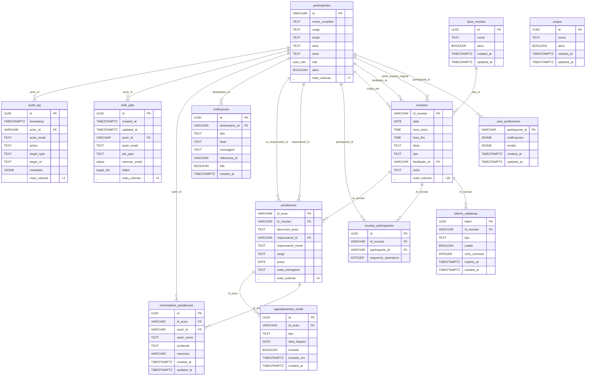

# SCHEMA.md
<!-- gerado automaticamente por /snapshot — não editar -->
<!-- last_update: 2026-06-11T01:02-0300 -->

Diagrama relacional do Hospital Reuniões. Renderiza nativo no GitHub.

## Diagrama ER (Mermaid)

## Indexes principais

| Tabela | Index | Colunas | Origem |
|--------|-------|---------|--------|
| `participantes` | `idx_participantes_email` | `email` | `001_create_participantes.sql` |
| `participantes` | `idx_participantes_setor` | `setor` | `001_create_participantes.sql` |
| `participantes` | `idx_participantes_ativo` | `ativo` | `001_create_participantes.sql` |
| `participantes` | `idx_participantes_auth` | `auth_user_id` | `001_create_participantes.sql` |
| `participantes` | `idx_participantes_super_admin` | `is_super_admin` | `017_add_super_admin.sql` |
| `participantes` | `idx_participantes_access_profile` | `access_profile` | `036_add_access_profile.sql` |
| `participantes` | `idx_participantes_setor_id` | `setor_id` | `038_fk_indexes.sql` |
| `participantes` | `idx_participantes_cargo_id` | `cargo_id` | `038_fk_indexes.sql` |
| `reunioes` | `idx_reunioes_status` | `status_ata` | `002_create_reunioes.sql` |
| `reunioes` | `idx_reunioes_data` | `data DESC` | `002_create_reunioes.sql` |
| `reunioes` | `idx_reunioes_setor` | `setor` | `002_create_reunioes.sql` |
| `reunioes` | `idx_reunioes_fireflies` | `fireflies_meeting_id` | `002_create_reunioes.sql` |
| `reunioes` | `idx_reunioes_programada` | `data, status_ata` | `002_create_reunioes.sql` |
| `reunioes` | `idx_reunioes_documento_id_origem` | `documento_id_origem` | `016_importacao_ata_legada.sql` |
| `reunioes` | `idx_reunioes_arquivo_hash` | `arquivo_hash` | `016_importacao_ata_legada.sql` |
| `reunioes` | `idx_reunioes_importado_por` | `importado_por_id` | `020_historico_importacao.sql` |
| `reunioes` | `idx_reunioes_live` | `data DESC` | `030_add_soft_delete.sql` |
| `reunioes` | `idx_reunioes_lembrete_pendente` | `data, hora_inicio` | `035_add_lembrete_24h_reunioes.sql` |
| `reunioes` | `idx_reunioes_criada_por` | `criada_por` | `036_add_access_profile.sql` |
| `reunioes` | `idx_reunioes_facilitador` | `facilitador_id` | `038_fk_indexes.sql` |
| `reunioes` | `idx_reunioes_tipo_id` | `tipo_id` | `038_fk_indexes.sql` |
| `reuniao_participantes` | `idx_reuniao_part_reuniao` | `id_reuniao` | `002_create_reunioes.sql` |
| `reuniao_participantes` | `idx_reuniao_part_participante` | `participante_id` | `002_create_reunioes.sql` |
| `pendencias` | `idx_pendencias_reuniao` | `id_reuniao` | `003_create_pendencias.sql` |
| `pendencias` | `idx_pendencias_responsavel` | `responsavel_id` | `003_create_pendencias.sql` |
| `pendencias` | `idx_pendencias_status` | `status` | `003_create_pendencias.sql` |
| `pendencias` | `idx_pendencias_prazo` | `prazo` | `003_create_pendencias.sql` |
| `pendencias` | `idx_pendencias_co_responsavel` | `co_responsavel_id` | `014_add_externo_co_responsavel.sql` |
| `pendencias` | `idx_pendencias_live` | `prazo` | `030_add_soft_delete.sql` |
| `pendencias` | `idx_pendencias_nota` | `id_nota` | `042_add_id_nota_pendencias.sql` |
| `agendamentos_email` | `idx_agendamentos_disparo` | `data_disparo, enviado` | `003_create_pendencias.sql` |
| `agendamentos_email` | `idx_agendamentos_email_id_acao` | `id_acao` | `038_fk_indexes.sql` |
| `tokens_validacao` | `idx_tokens_reuniao` | `id_reuniao` | `004_create_tokens_validacao.sql` |
| `tokens_validacao` | `idx_tokens_expires` | `expires_at` | `004_create_tokens_validacao.sql` |
| `comentarios_pendencias` | `idx_comentarios_id_acao` | `id_acao` | `007_create_comentarios_pendencias.sql` |
| `comentarios_pendencias` | `idx_comentarios_autor` | `autor_id` | `007_create_comentarios_pendencias.sql` |
| `comentarios_pendencias` | `idx_comentarios_created` | `created_at DESC` | `007_create_comentarios_pendencias.sql` |
| `notificacoes` | `idx_notificacoes_destinatario` | `destinatario_id, lida` | `008_create_notificacoes.sql` |
| `notificacoes` | `idx_notificacoes_created` | `created_at DESC` | `008_create_notificacoes.sql` |
| `notificacoes` | `idx_notificacoes_referencia` | `referencia_id` | `008_create_notificacoes.sql` |
| `audit_log` | `idx_audit_log_timestamp` | `timestamp DESC` | `018_create_audit_log.sql` |
| `audit_log` | `idx_audit_log_actor` | `actor_id` | `018_create_audit_log.sql` |
| `audit_log` | `idx_audit_log_target` | `target_type, target_id` | `018_create_audit_log.sql` |
| `audit_log` | `idx_audit_log_action` | `action` | `018_create_audit_log.sql` |
| `bulk_jobs` | `idx_bulk_jobs_actor` | `actor_id` | `019_create_bulk_jobs.sql` |
| `bulk_jobs` | `idx_bulk_jobs_status` | `status` | `019_create_bulk_jobs.sql` |
| `bulk_jobs` | `idx_bulk_jobs_created_at` | `created_at DESC` | `019_create_bulk_jobs.sql` |
| `cargos` | `cargos_nome_lower_idx` | `(lower(nome` | `027_create_taxonomy_tables.sql` |
| `tipos_reuniao` | `tipos_reuniao_nome_lower_idx` | `(lower(nome` | `027_create_taxonomy_tables.sql` |

---
**Resumo:** 13 tabelas · 17 relacionamentos FK detectados.
